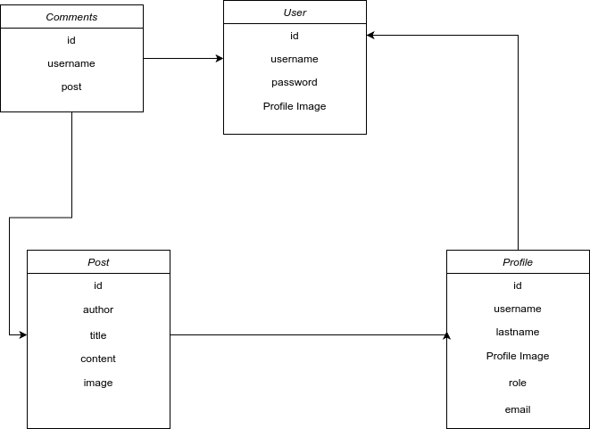
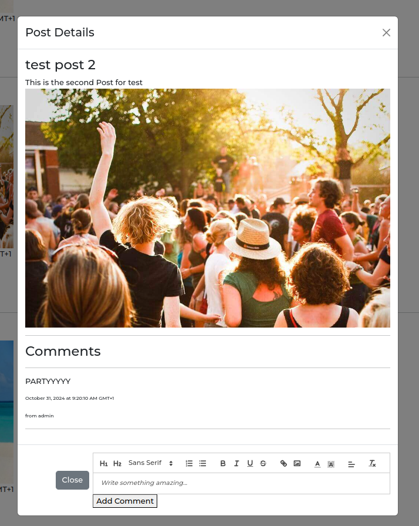

# [Sokrates Backend](https://code5.ddns.net)

---

## Links

[Visit frontend site here](https://code5.ddns.net)

## Table of Contents

- [Sokrates Backend](#sokrates-backend)
  - [Links](#links)
  - [Table of Contents](#table-of-contents)
  - [Backend](#backend)
    - [Introduction](#introduction)
    - [Database diagram](#database-diagram)
    - [Relationships](#relationships)
    - [Packages](#packages)
  - [Deployment](#deployment)
    - [Heroku Configuration](#heroku-configuration)
- [Sokrates Frontend](#sokrates-frontend)
  - [Introduction](#introduction-1)
  - [User Experience](#user-experience)
  - [Menu Items](#menu-items)
  - [Posts](#posts)
    - [Posts Features](#posts-features)
  - [User Profile](#user-profile)
  - [Future Features](#future-features)
  - [Page Styling](#page-styling)
  - [Technologies used](#technologies-used)
  - [Deployment](#deployment-1)
    - [Heroku Configuration](#heroku-configuration-1)
  - [Credits](#credits)

## Backend

### Introduction

Sokrates is a school managment system. In this stage we will focus on backend.

### Database diagram

---

**Entities**

* **User:** Stores user account information.
    * Attributes:
        * id Primary Key.
        * username (CharField).
        * password (CharField).

* **Profile:** Contains detailed user profile information.
    * Attributes:
        * id Primary Key.
        * owner (OneToOneField): Foreign Key referencing User.id (one-to-one relationship).
        * first_name (CharField).
        * last_name (CharField).
        * image (ImageField).
        * created_at (DateTimeField).
        * updated_at (DateTimeField).

* **Post:** Stores user-generated content.
    * Attributes:
        * id  Primary Key.
        * owner (ForeignKey): Foreign Key referencing User.id (user who created the post).
        * title (CharField).
        * content (TextField).
        * image (ImageField).
        * created_at (DateTimeField).
        * updated_at (DateTimeField).
         
  **Comment:** Stores user comments on posts.
    * Attributes:
        * id Primary Key.
        * owner (ForeignKey): Foreign Key referencing User.id (user who created the comment).
        * post (ForeignKey): Foreign Key referencing Post.id (post being commented on).
        * content (TextField).
        * created_at (DateTimeField).
        * updated_at (DateTimeField).

### Relationships

* A User has a one-to-one relationship with a Profile.
* Only user with role "admin" can perform create Posts.
* A User can Comment on a Post.

---

### Packages

* [Django](https://www.djangoproject.com/)
* [Django REST Framework](https://www.django-rest-framework.org/)
* [Django CORS Headers](https://github.com/adamchainz/django-cors-headers)
* [Pillow](https://pypi.org/project/pillow/)
  
** Install with pip **
  
  $ pip install -r requirements.txt

## Deployment

### Heroku Configuration

* [Heroku](https://www.heroku.com/)

1. Create an app on Heroku.
2. On the Heroku app's settings page, add the following config vars:
   - `DATABASE_URL`: Your PostgreSQL server URL.
   - `SECRET_KEY`: A secret key from [Djecrety](https://djecrety.ir/).
   - `DISABLE_COLLECTSTATIC`: `1`.
   - `CLOUDINARY_URL`: Your Cloudinary API environment variable if used.

# Sokrates Frontend

## Introduction

After visiting the frontend site, you will be directed to the Home page. Please login with your username and password.
The user cannot Register an account. All Users get for a first time use a card from the school with the login information.
After logging in you can create your Profile.(Future Feature).

All users get a role to determine what they can do.Only the admin can create, edit or delete posts all other Users can only view posts
and only the students and techers can leave comments.

The roles are : 
- Admin
- Teacher
- Student
- Guest

After Success Login, you will be redirected to the Home page. The Menu will be displayed based on your role.

---

## User Experience

* App is responsive
* Admin create Posts: Only the user with the role Admin can Create Edit and Delete a post.
* Registired Users can leave comments on posts.
* Guest can only view posts.

---

## Menu Items

* Role guest

* Role admin

* Role teacher

* Role student

---

## Posts

* Create Post

* Edit Post

* Post Open and Comments

* Admin Actions

---

### Posts Features

For text content is used the WYSIWYG editor (Quill).
Expect the Text input you can add images as well on the editor for Content and Comments
as well you can format the text with the editor.

---

## User Profile

* User Profile

---

## Future Features

* Vote system
* Messages system
* Classroom system
* Notification system

---

## Page Styling

Currently the page is styled with little Bootstrap. 
Styling is future work.

---

## Technologies used

* React
* React Bootstrap
* Axios
* React Quill
* React Router Dom
* FontAwesome

---

## Deployment

### Heroku Configuration

1. **Create a Heroku Account**: Sign up for [Heroku](https://signup.heroku.com/) to manage cloud-based applications.

2. **Prepare Your Application**:
   - Push your code to the Repositoryon GitHub.
   - Ensure all necessary changes are committed for deployment.

3. **Create a New Heroku Application**:
   - Log in to Heroku and create a new app.
   - Choose a unique name and select a region.

4. **Set Environment Variables**:
   - Navigate to your app's settings on Heroku.
   - Add required environment variables under "Config Vars" to secure sensitive data.

5. **Deploy Your Application**:
   - Go to the "Deploy" tab in your app's Heroku dashboard.
   - Connect to your GitHub repository and choose the branch to deploy.
   - Click "Deploy Branch" to start the deployment process.

6. **Verify Deployment**:
   - Once deployed, Heroku provides a URL for your live application.
   - Open this URL in your browser to ensure the application is running correctly.

---

## Credits

All Images were taken from google image search for testing purposes only and are not owned by me or Sokrates.